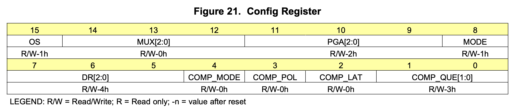

Reading the values off light sensors or more specifically in our case, Analog to Digital Convertors (ADC/ADS) is really trivial with the use of already available modules like `Adafruit_Blinka` or `RPI.GPIO`. But this takes away the understanding of how you would actually interact with a I2C device and the magic that happens under the hood. This post serves to demystify some of the magic by looking what exactly are the bytes that are we are sending to these I2C devices.

> As to how we will actually send the bytes to the I2C register would probably deserve another write-up of its own

<!--truncate-->

Since we will be working with ADC/ADS in this project, it would be nice to use the ADS we have (`ADS1015` & `ADS1115`) as examples as to how we would generally interact with I2C devices. The goal of it is really to develop a good sense of what is happening when you call `chan.value` or `chan.voltage`.

:::note
I will not get too much into what exactly is the [I2C Protocol](https://www.circuitbasics.com/basics-of-the-i2c-communication-protocol/), but a good intuition to hold on to is that using I2C you can connect multiple peripheral devices (in our cases multiple ADS/ADC) to a single master device (e.g. RPI). And it achieves this by using the `SCL` (Clock Line) and `SDA` (Data Line) of the master and peripheral devices.
:::

The important thing to note is that every I2C device provides its own "way" of reading and writing, but I believe we are able to gain sufficient intuition of how all these works from exploring how we can read values off the **`ADS1015`**.

## `ADS1015`

First, we will need to look at the [datasheet](https://www.ti.com/lit/ds/symlink/ads1015.pdf?ts=1639761824088&ref_url=https%253A%252F%252Fwww.ti.com%252Fproduct%252FADS1015) provided by the manufacturer of the `ADS1015`. It tells us what registers are available for us to interact with and how can we use these registers to get the values we want.

There are 4 registers (excluding Address Pointer Register) present in the `ADS1015`:

| Register                 | Address | Description                                                                                                                                                                           |
| ------------------------ | ------- | ------------------------------------------------------------------------------------------------------------------------------------------------------------------------------------- |
| Address Pointer Register | -       | (`8-bit`) You access the other registers through these registers. It stores the references to the other registers on the device                                                       |
| Conversion Register      | `0b00`  | (`16-bit`) Not the most intuitive name but this stores the last **converted** value. Basically it stores the input value we are interested in (e.g. value at `A0`)                    |
| Config Register          | `0b01`  | (`16-bit`) As the name suggests, this is the register where we set config parameters such as single-ended or continuous mode. This is also where we can set the data rate of the ADS. |
| Lo_Thresh Register       | `0b10`  | _Not relevant as of now_                                                                                                                                                              |
| Hi_Thresh Register       | `0b11`  | _Not relevant as of now_                                                                                                                                                              |

:::info
Some I2C device would have a **Device ID** register that stores the device information like manufacturer ID or an ID identifying the model of the device.

_Initially I hoping that the ADS we have contains this register so that we can differentiate the between `ADS1015` and `ADS1115` without any human verification but oh well.._
:::

### Modes of Operation

Before getting into reading the values we want, it is perhaps useful to know the different modes that the `ADS1015` operate in.

| Modes            | Description                                                                                                                                                       |
| ---------------- | ----------------------------------------------------------------------------------------------------------------------------------------------------------------- |
| **Single-ended** | Does 1 conversion (1 reading) and subsequently powers down                                                                                                        |
| **Continuous**   | After setting it to continuous via the Config Register (more on this below), it goes on (as the name suggests) continuously converting values for our consumption |

> However, you will realise later on that, Continuous mode does not work well when we are switching between different input channels and getting readings at the same time.

**Now to the fun part of setting registers and reading values**

### Configuring it to get what we want

This is where the datasheet comes in because without it we will be clueless as to how the device work. Unlike software, it would be of much greater pain in comparsion to discover how a hardware device works under the hood without any documentation. To put it simply, we want to know what bytes (down to the bits) should we send to the Config Register of the device so that we can get what we want, and for us to know what bits should we send, we will need the datasheet.

As specified by the datasheet (refer to page 24), we will need to set the 16-bit Config register accordingly to what each bit represent.



> Full details can be found in page 24 of the datasheet

But it is useful to point out that:

1. `MUX[2:0]` : Tells the device which input pins (`Ax`) are we interested in reading values off
    - `0b100` corresponds to `A0`

2. `MODE` : _self explanatory_

3. `DR[2:0]` : Data rate of the device (how fast we want the device to sample the input pins)
    - Likely only useful when it is in Continuous mode

_So, lets say we have a light sensor attached to `A0` and we would want to read the value at that input pin..._

The following will be the 16 bits that we will set in the Config Register:

```
1 100 001 1 100 00011
```

> You can practically ignore the last 5 bits, it is all default configs that do not matter as of now

### Setting the Config Register

To set the config register, we will be using the built-in `i2c-tools` package in the RPI, which provides commands to read/write from/to I2C devices. It does not give us a magic command to get the values off the `ADS1015` like the `adafruit_blinka` module, we will have to do it manually ourselves, but the magic it possess the how it is able to send these bits via the SDA and SCL lines adhering to the the I2C protocol.

First we will need to know what the address of the `ADS1015`. By default a single ADS will be assigned to address `0x48` or `72` (in decimal).

:::info
You can change the address of a ADS1015 by connecting the `ADDR` pin to the SDA/SCL/GND lines

_Details are in the datasheet_
:::

Next, we know that the Config Register is at `0b01`, and that is all we need to set the 16 bits we have built.

```bash
# i2cset -y <i2c-bus> <i2c-dev-addr> <i2c-dev-register-address> <16-bit-payload-hex> <mode>
i2cset -y 1 0x48 0x1 0xC383 w
```

**Note that the hexadecimal of the 16-bit payload we built above is `0xC383`**

:::info
**i2c-bus**

You can find out what is the i2c-bus by `ls /dev | grep i2c` where you will get `i2c-x` as the result. `x` will be the i2c-bus number.

**i2c-dev-addr**

Now that you have the i2c-bus you can do `i2cdetect -y 1` and see which address is active. Note that the address is in hex representation.

**mode**

`w` corresponds to writing a 16-byte data block. By default it only accepts a data range of 1 byte
:::

### Reading the Conversion Register

Now that we have set the Config register, and if we already have a light sensor attached to it, we can read the value off the Conversion register.

```bash
# i2cget -y <i2c-bus> <i2c-dev-id> <i2c-dev-register-address> <mode>
i2cget -y 1 0x48 0x0 w
```

:::warning
Results of `i2cget` is **little endian** (LSB comes first)
:::

You will get a hexadecimal return value from the command, and in my case at the time of testing (with a light sensor attached) I got the following value:

**`0x5046`**

Converting it to decimal (bearing in mind it is little endian) we get the value of **18000**. This value is what the raw ADS value that we get from `chan.value` using adafruit modules.

_I have not figured out how the conversion to voltage work but from the `adafruit_ads1x15` module the conversion seems to be of such:_

```python
# https://github.com/adafruit/Adafruit_CircuitPython_ADS1x15/blob/e33ed60b8cc6bbd565fdf8080f0057965f816c6b/adafruit_ads1x15/analog_in.py#L58-L62
def voltage(self):
    # self.value is the raw ADS value
    volts = self.value * _ADS1X15_PGA_RANGE[self._ads.gain] / 32767
    return volts
```

> In the 16bit payload that we have used, we were using the default gain which corresponds to `+-4.096`

Therefore, the voltage value that we get would be **`(18000*4.096)/32767 = 2.25`**

:::note
An important thing to note that in our 16-bit payload to the Config register we have to specify an input that we reading from, therefore to get the value of a different input we will need to set the Config register again, this time with the bits that corresponds to another input of the ADS1015.

Similarly, since we have set the device to be single-ended mode, to get the latest value we will need to do the same process again, setting the config register and reading the value off the conversion register. If we are in continuous mode, we do not need to set the config register after the first time and we can always just read the latest value off the conversion register, thus making the polling faster.

**In the case of reading multiple inputs, you will now realize that setting the ADS1015 to continuous mode is not very helpful since we will need to reset the config register to switch inputs**
:::


