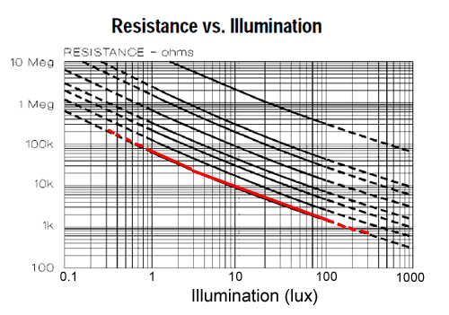
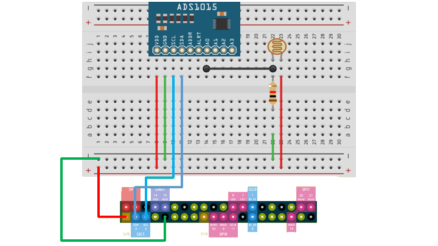

## Primer on Photocells

To put it simply, photocells are just resistors where its resistance is **inversely proportional** to the amount of light that is shining on it (as light increases, resistance decreases).

:::info
However, it is important to note that they are not sensitive to all wavelength of light. In particular they tend to be sensitive to light between 700nm (red) and 500nm (green) light
:::

> Since the washer/dryer's light is _kinda_ orange, the photocell should be good at capturing the changes.

In the legacy implementation, they have chosen to make use of a [**pull-down**](https://www.circuitbasics.com/pull-up-and-pull-down-resistors/) resistor to measure the voltage between the pull-down resistor and the photocell (it will be clearer when you see the circuit diagram below). 

:::info
It is then important to note that the amount of resistance of the **pull-down** resistor will affect the precision of our measurement (in this case, the voltage).



**This is a log-graph**

Thus, this means that if we were to use a high resistance **pull-down** we may not be able to accurately measure the voltage at the higher end of the light intensity range.
:::

> However, since the application is more binary (on/off), I am not entirely sure if we will have to consider the resistance of the pull-down resistor that much.

## Circuit



### Sanity Check

_TODO Add link to `/script` (to be used for testing)_

These are some values that we should ought to obtain (values are raw channel values `chan.value`):


```
3.3V Input (A0 active, A1-3 inactive)

|      0 |      1 |      2 |      3 |
-------------------------------------
|  12496 |   5552 |   5808 |   5648 |
|  12544 |   5712 |   5712 |   5536 |
|  12224 |   5888 |   5712 |   5616 |
|  12128 |   5648 |   5600 |   5632 |
|  12544 |   5568 |   5456 |   5744 |
|  12272 |   5520 |   5360 |   5648 |
|  11776 |   5712 |   5680 |   5312 |
|  12432 |   5680 |   5264 |   5536 |
|  12176 |   5376 |   5440 |   5680 |
|  11776 |   5392 |   5568 |   5536 |
|  12480 |   5616 |   5456 |   5568 |
|  11648 |   5760 |   5264 |   5600 | ------------
|   8432 |   5392 |   5424 |   5600 | 
|   8224 |   5520 |   5344 |   5504 |
|   8768 |   5504 |   5152 |   5280 |
|   8336 |   5152 |   5312 |   5536 | Period where light is restricted
|   8656 |   5376 |   5456 |   5744 |
|   8672 |   5456 |   5104 |   5392 |
|   8320 |   5248 |   5312 |   5600 |
|   8768 |   5344 |   5536 |   5792 | 
|  12336 |   5792 |   5824 |   5536 | -----------
|  12000 |   5840 |   5520 |   5744 |
|  12448 |   5456 |   5568 |   5872 |
|  12080 |   5712 |   5536 |   5504 |


5.0V Input (A0 active, A1-A3 inactive)

|      0 |      1 |      2 |      3 |
-------------------------------------
|  29328 |   6800 |   6768 |   7088 |
|  29072 |   6528 |   7088 |   7264 |
|  30928 |   6912 |   7104 |   6976 |
|  29184 |   6880 |   7024 |   7216 |
|  31088 |   6784 |   7312 |   7088 |
|  30752 |   6992 |   7120 |   6912 |
|  29120 |   6736 |   6496 |   6960 |
|  30272 |   6736 |   6624 |   6560 |
|  31104 |   6624 |   6912 |   6672 |
|  29568 |   6896 |   6736 |   6496 |
|  21264 |   6256 |   6144 |   6048 | ------------
|  17248 |   5856 |   6224 |   6144 |
|  15616 |   6016 |   6000 |   5968 |
|  16864 |   6016 |   6032 |   6064 |
|  17104 |   5888 |   6176 |   6144 | Period where light is restricted
|  15504 |   6048 |   5984 |   6032 |
|  16224 |   5920 |   6080 |   5840 |
|  15568 |   5920 |   6224 |   6128 |
|  29632 |   6816 |   6736 |   6416 | ------------
|  30432 |   6752 |   6688 |   6528 |
|  31200 |   6608 |   6816 |   6640 |
|  29408 |   6848 |   6880 |   6496 |
|  30784 |   6848 |   6688 |   6512 |
|  31024 |   6656 |   6752 |   6736 |
```

:::note
A simple sanity check would also be to look `chan.voltage`/voltage readings.

**If we are using a `3.3V` input, we should see voltage levels around `1.5-2V`, and we are using a `5.0V` input, we should expect voltage levels around `3.0-4.0V`.**
:::

:::warning
Channels with no analog input would still record some voltage values and it might falculate when testing the LDR but note that the values are not accurate.
:::

## Reference

- https://learn.adafruit.com/photocells
